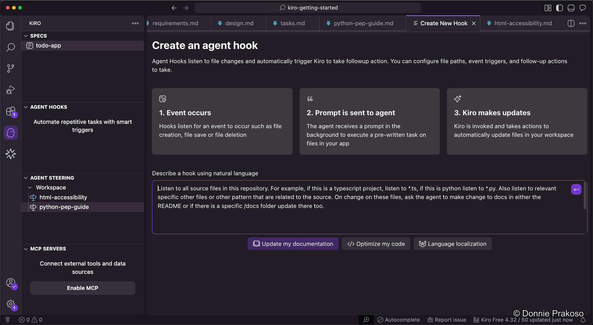
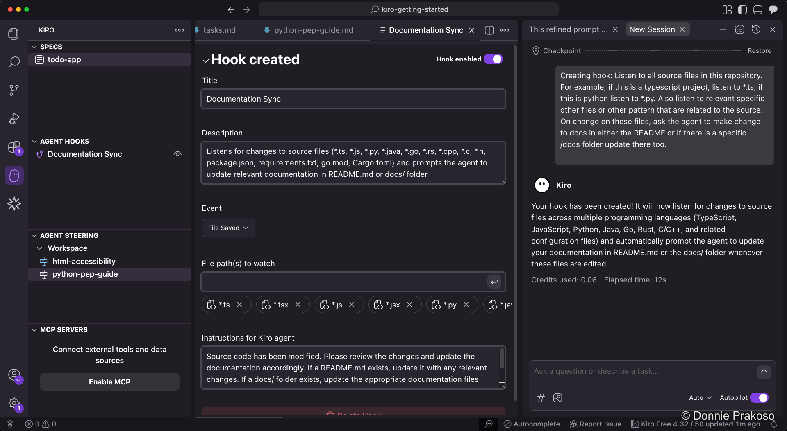

import { Steps, Aside } from '@astrojs/starlight/components';

Agent hooks are automation tools that automatically execute predefined actions when specific events occur in Kiro. You define the event, and Kiro automatically triggers the action.

## Understanding agent hooks

Agent hooks have three components:
- **Prompt** — The instructions sent to Kiro when the hook triggers
- **Event** — What triggers the hook (e.g., file changes)
- **Templates** — Predefined hook templates for common workflows

## Configuring a hook

<Steps>

1. **Create or select a hook**

   Once created, you can modify the hook's details:

   

2. **Configure the trigger event**

   Select which event should trigger the hook.

3. **Set the file path to watch**

   Specify which file paths Kiro should monitor for changes.

4. **Write the instructions**

   Add the prompt or instructions that will be sent to Kiro when the event fires.

5. **Enable or disable the hook**

   You can toggle hooks on and off as needed. Be mindful — hooks always trigger based on their configuration, and too many active hooks can queue up operations in Kiro.

</Steps>

<Aside type="caution">
Agent hooks fire automatically based on their configuration. Adding too many hooks can cause operations to queue up in Kiro. Start with a few essential hooks and add more as needed.
</Aside>
