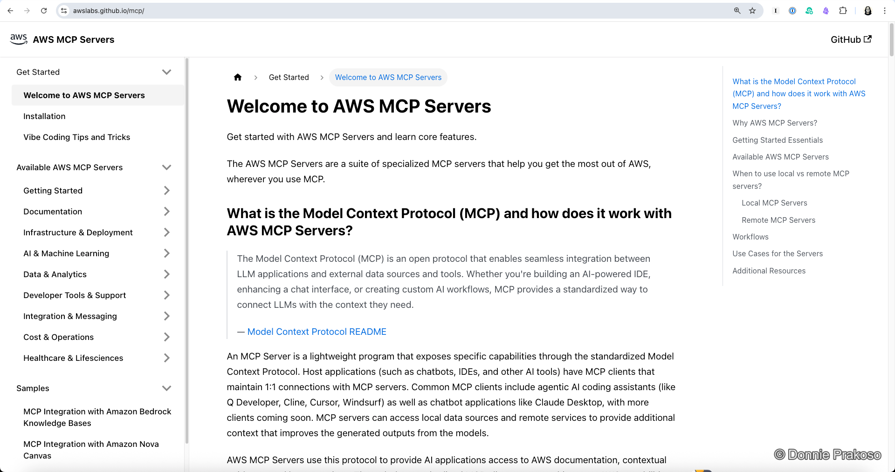
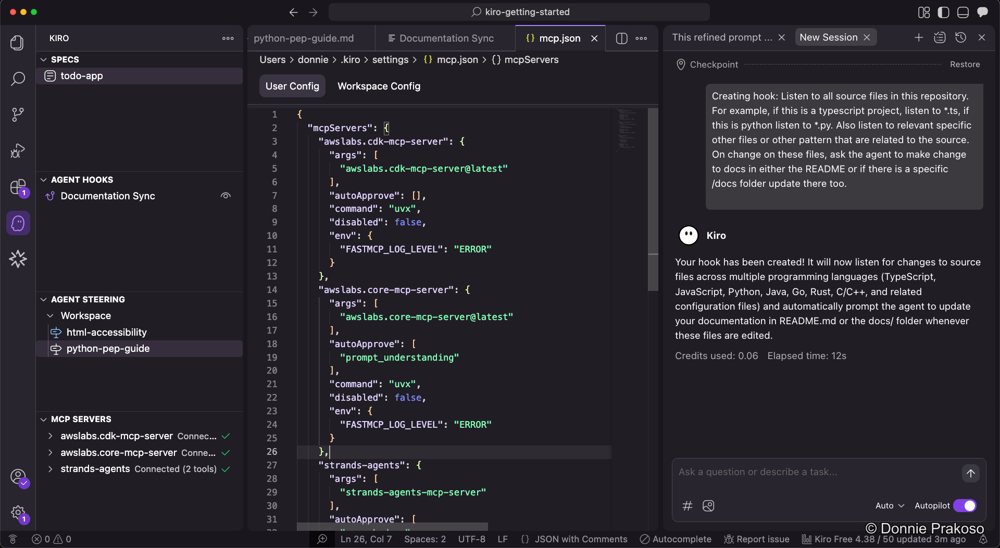

import { Steps, Aside } from '@astrojs/starlight/components';

**Model Context Protocol (MCP)** is an open protocol that standardises how applications provide context to LLMs. With MCP, Kiro can connect to various data sources and tools through MCP servers, extending its capabilities beyond built-in features. This allows Kiro to interact with databases, APIs, file systems, and other services in a standardised way.

## AWS MCP servers

If you're building on AWS, you can find a curated list of MCP servers on the [AWS MCP Servers](https://awslabs.github.io/mcp/) website.

## Configuring MCP servers in Kiro

<Steps>

1. **Add MCP server configuration**

   To define MCP servers, add them as you normally would in any MCP client. The configuration follows the standard MCP format.

   

</Steps>

<Aside type="tip">
MCP servers extend what Kiro can do — from querying databases to interacting with cloud services. Combined with steering docs and agent hooks, they form a powerful toolkit for your development workflow.
</Aside>

With **Steering Docs**, **Agent Hooks**, and **MCP Servers** configured, Kiro is now equipped with the tools and knowledge it needs. Let's start executing the build tasks.
