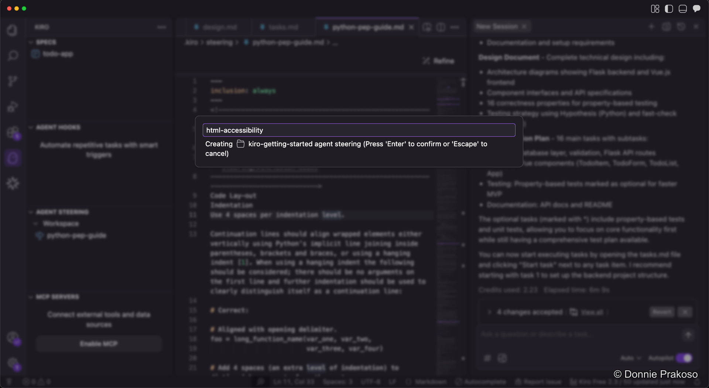
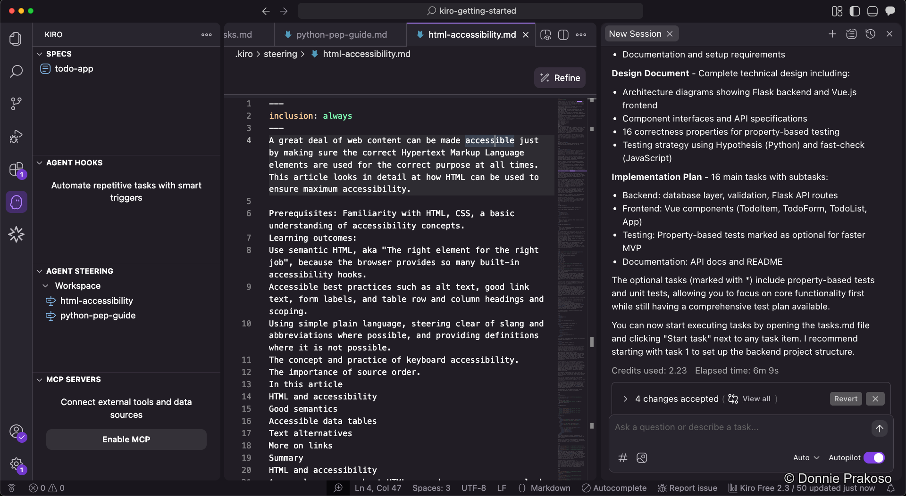
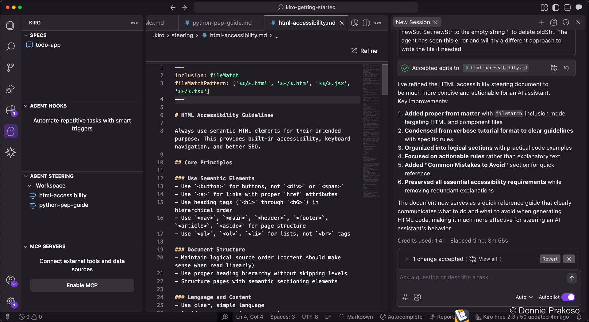
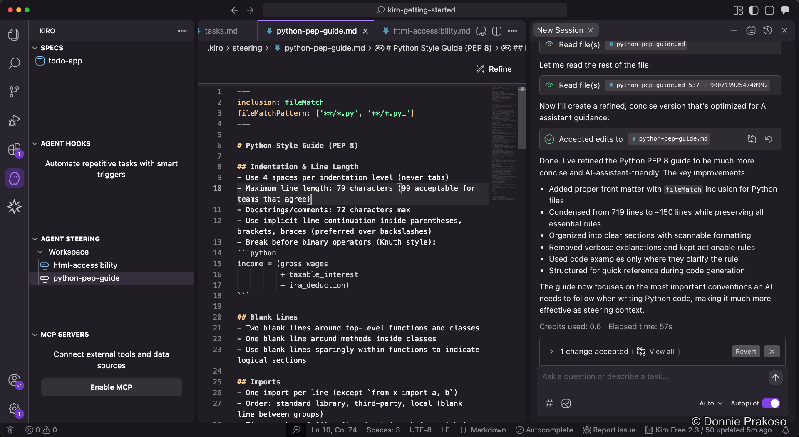

import { Steps, Aside } from '@astrojs/starlight/components';

You can add multiple steering docs to separate context for Kiro. Let's add an HTML accessibility guide and learn how to refine steering docs.

<Steps>

1. **Add an HTML accessibility guide**

   Create a new steering doc named `html-accessibility`. This helps Kiro structure web content with proper HTML tags and attributes for accessibility.

   

2. **Add the accessibility content**

   Paste content from [HTML: A good basis for accessibility](https://developer.mozilla.org/en-US/docs/Learn_web_development/Core/Accessibility/HTML) into the steering doc. The content covers semantic HTML, good link practices, accessible data tables, text alternatives, and more.

   

   However, this raw documentation isn't optimised for Kiro to process.

3. **Refine the document**

   Click the **Refine** button to make the document more "agent-friendly" for Kiro. This restructures the content into a format that's easier for the AI to follow.

   

   The refined version is much more structured and concise — ready for Kiro to use as a steering doc.

4. **Compare refined results**

   When you refine the Python PEP style guide as well, you can see how the Refine feature condenses content significantly — from 719 lines to around 150 lines — without losing the essence.

   

</Steps>

<Aside type="tip">
The **Refine** feature is useful for any steering doc that contains raw documentation. It strips unnecessary content and restructures the guide into clear, actionable instructions that Kiro can follow effectively.
</Aside>
