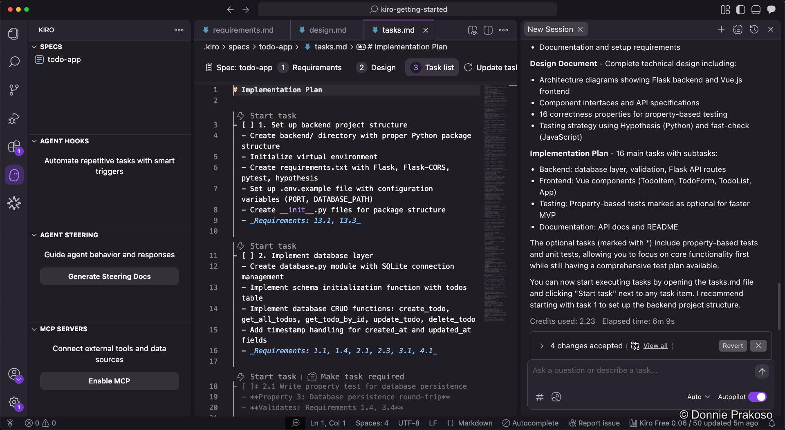
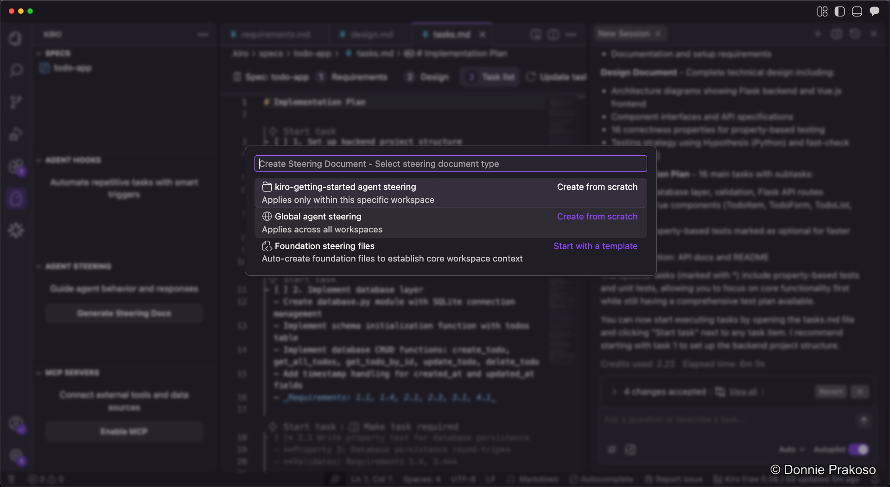
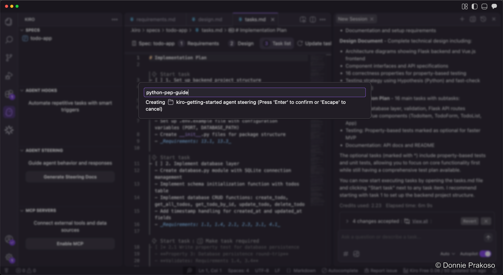

import { Steps, Aside } from '@astrojs/starlight/components';

## Understanding the task list

Once Kiro finishes the implementation plan, you can open the task list document to see all structured tasks.

The task list contains structured tasks organised from the ground up. You can:
- **Track progress** for each task
- **See dependencies** between tasks
- Click **Start task** to have Kiro begin working

<Aside type="caution">
Before starting tasks, take time to configure **Steering Docs** first. These give Kiro persistent knowledge about your workspace and help it follow your coding standards.
</Aside>

## What are steering docs?

Steering docs give Kiro persistent knowledge about your workspace. You can add steering files to guide Kiro to follow established patterns, libraries, and standards.

<Steps>

1. **Open the steering docs panel**

   Navigate to the steering docs section in the sidebar. You have several options:

   

   - **Create from scratch** — Write a steering doc that applies to the current or all workspaces
   - **Auto-generate** — Have Kiro create steering files based on your project

2. **Add a Python PEP style guide**

   Since our app uses Python, we add the PEP style guide as a steering doc. Create a new steering file named `python-pep-guide`.

   

3. **Populate the steering doc**

   Add the content from the [Python PEP 8 style guide](https://peps.python.org/pep-0008/) to guide Kiro's Python code generation. The doc covers indentation, naming conventions, import ordering, and other style rules.

   

</Steps>

<Aside type="tip">
Steering docs support an `inclusion: always` directive that tells Kiro to always consider this guide. Learn more about inclusion modes at [Kiro docs](https://kiro.dev/docs/steering/inclusion-modes).
</Aside>
