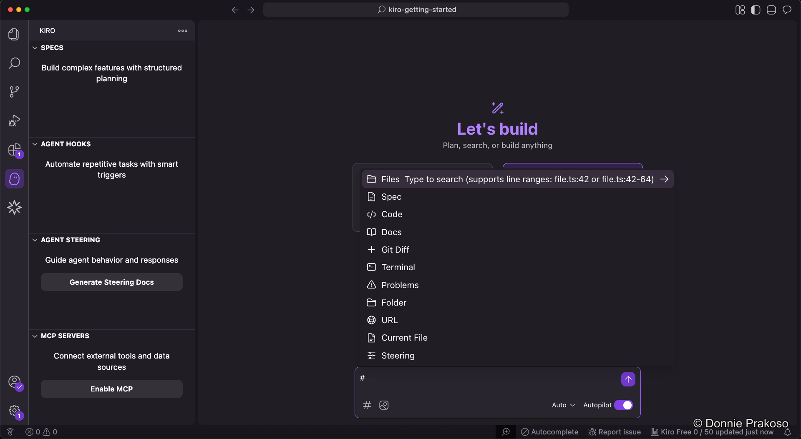

import { Steps, Aside } from '@astrojs/starlight/components';

## Adding explicit context

To get better results from Kiro, you can add context to your prompts. Kiro supports several context types, including files and images.



<Aside type="tip">
Adding context helps Kiro understand your project structure, coding patterns, and requirements more precisely.
</Aside>

## Creating a todo list app

In this workshop, we'll build a **todo list application** with a Python Flask backend and Vue.js frontend. Let's start with the initial prompt.

<Steps>

1. **Enter your prompt**

   In the Kiro chat, type the following prompt:

   ```text title="Initial prompt"
   Create a todo list application. This application is API first, using backend with Python running on Flask. The frontend is using Vue JS.
   ```

   

2. **Choose your approach**

   You can either select **Spec** to go directly into spec-driven development, or refine the prompt first using **Vibe** mode. We'll explore both approaches in the next section.

</Steps>
