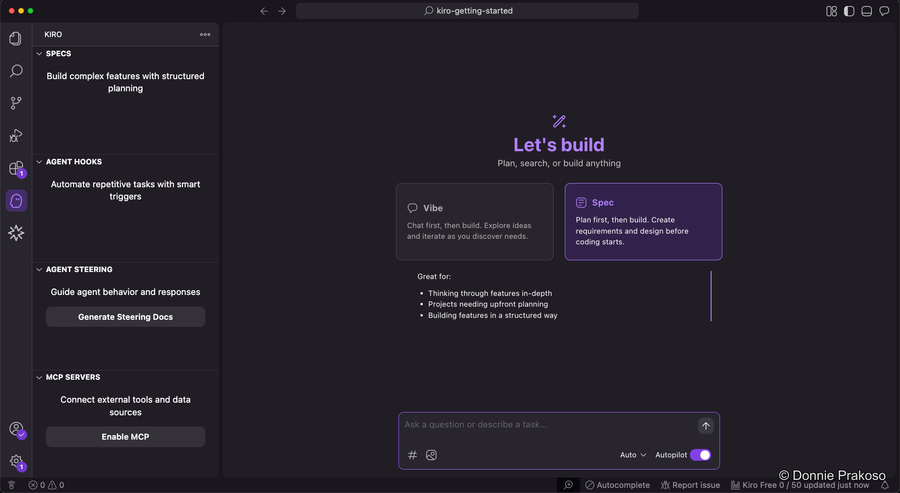
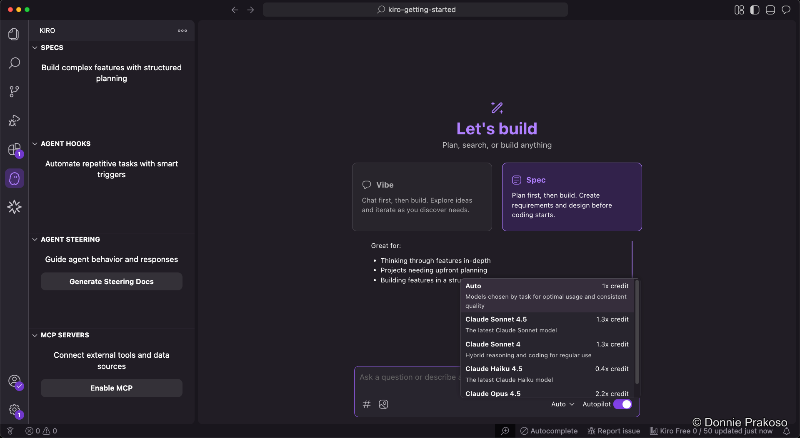

import { Tabs, TabItem, Aside } from '@astrojs/starlight/components';

Kiro offers two distinct modes for building applications. Understanding when to use each is key to getting the most out of the IDE.

<Tabs>
  <TabItem label="Spec (Recommended)">
    **Spec-driven development** is Kiro's recommended approach. When you provide a prompt in Spec mode, Kiro creates three structured documents:

    1. **Requirements** — User stories and acceptance criteria in EARS notation
    2. **Design** — Technical architecture, sequence diagrams, and implementation considerations
    3. **Implementation Plan** — A detailed task list with discrete, trackable tasks

    Use Spec mode when you want a structured, reviewable development process.
  </TabItem>
  <TabItem label="Vibe">
    **Vibe coding** is a more freeform mode. It's great for:

    - Rapid exploration and testing
    - Refining prompts before using Spec mode
    - Quick prototyping
    - Building when requirements are unclear

    As we'll see later, you can combine both — use Vibe to refine your prompt, then pass the result to Spec mode.
  </TabItem>
</Tabs>

## Model selection and Autopilot

- **Model selection** — You can choose from available models, though **Auto** is recommended. Kiro will optimise which model to use. Model selection influences both results and credit usage.
- **Autopilot mode** — An autonomous execution feature where Kiro can make multiple code changes, run commands, and make architectural decisions across a codebase to complete complex tasks with minimal human intervention.

<Aside type="tip">
Using the **Auto** model setting lets Kiro pick the best model for each task, balancing quality and credit usage.
</Aside>

## Open Weight Models

Kiro now supports **open weight models** in addition to Claude. These models offer different strengths and credit costs:

| Model | Credit Multiplier | Best For |
|-------|------------------|----------|
| **DeepSeek v3.2** | 0.25x | Agentic workflows, multi-step tool calling, maintaining state across long sessions |
| **MiniMax 2.1** | 0.15x | Multilingual programming (Rust, Java, Go, C++, Kotlin, TypeScript), UI generation |
| **Qwen3 Coder Next** | 0.05x | Long agentic CLI sessions, 256K context support, budget-friendly coding |

<Aside type="note">
Open weight models are available to both free and paid users. Select them from the model dropdown in the IDE or CLI. Inference runs in AWS US East (N. Virginia) region.
</Aside>

**When to use open weight models:**
- **Quick iterations and boilerplate** — Use Qwen3 Coder Next (0.05x) for routine tasks
- **Complex debugging** — DeepSeek v3.2 excels at maintaining context across debugging sessions
- **Frontend development** — MiniMax 2.1 is strong at generating web, Android, and iOS UI code
