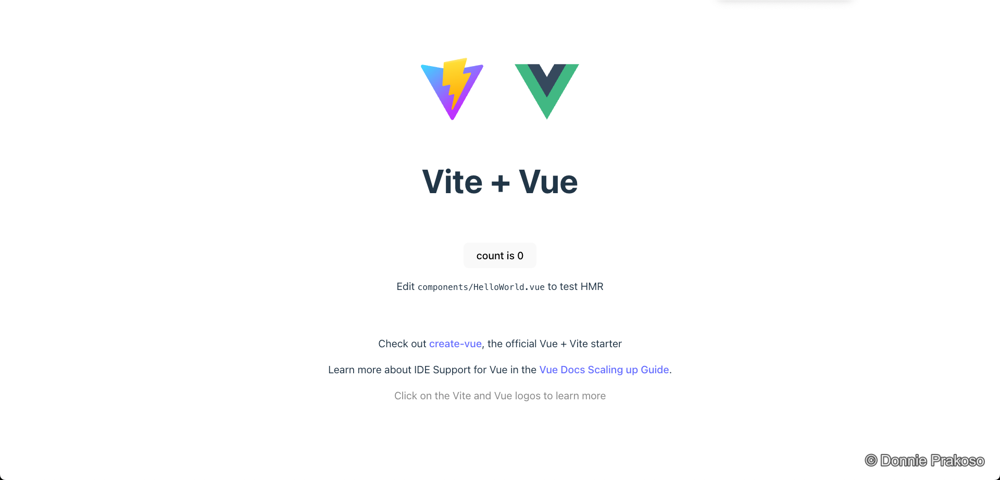
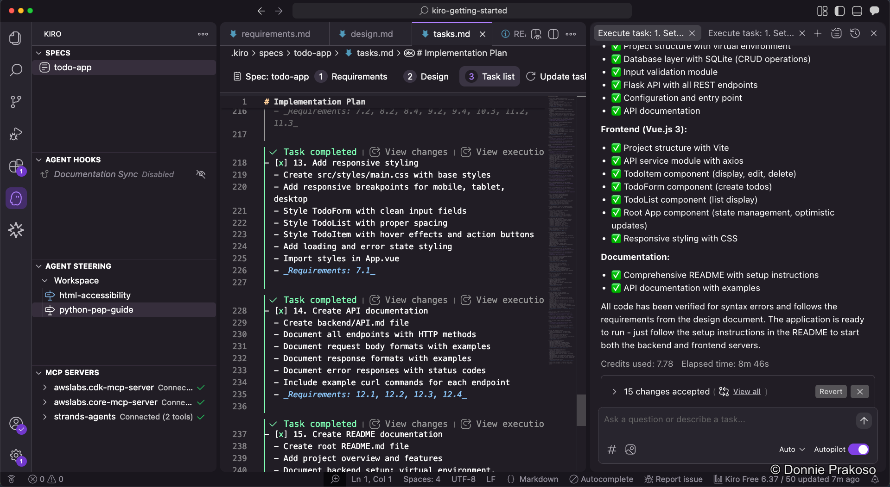

import { Aside } from '@astrojs/starlight/components';

## Frontend running

As tasks progress, Kiro gets the frontend application up and running.

## All tasks completed

Once all tasks are finished, Kiro verifies that all code follows the requirements defined in the specs.

Kiro has:
- Completed all implementation tasks
- Verified the code against the requirements
- Ensured the application structure matches the design document

<Aside type="tip">
After all tasks complete, review the generated code and the README file. Kiro includes setup and run instructions in `README.md` — a practice worth reinforcing with an agent hook.
</Aside>

The build is complete. Next, let's set up and run the application to make sure everything works.
