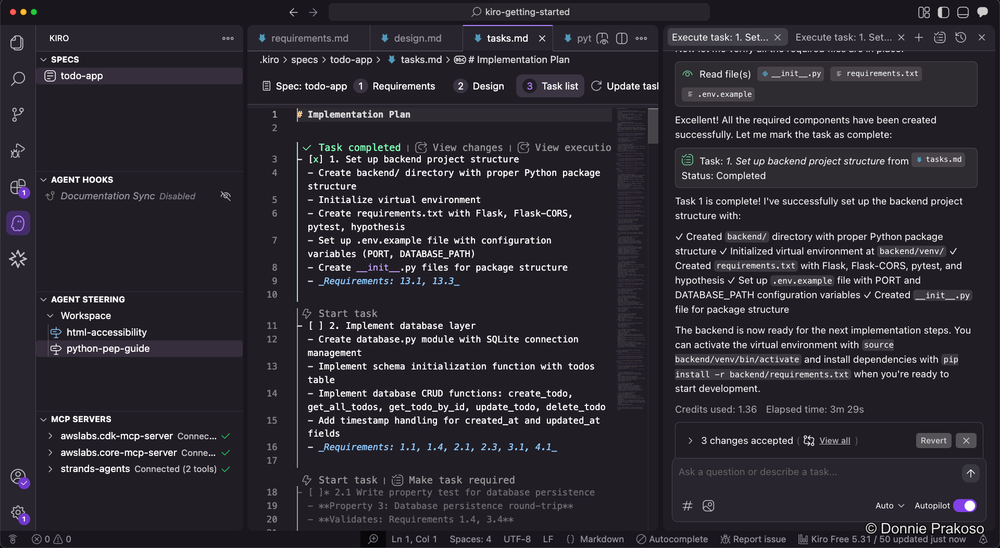
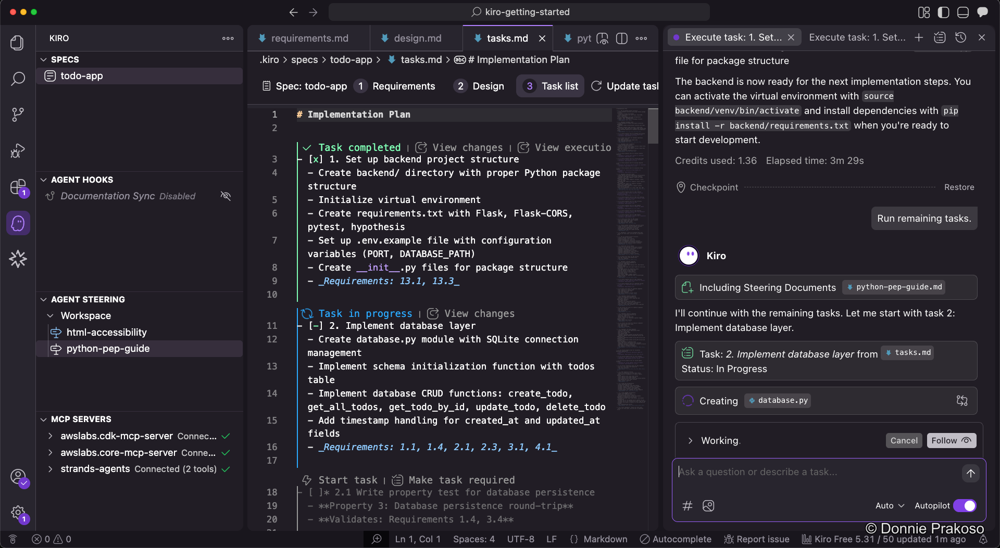
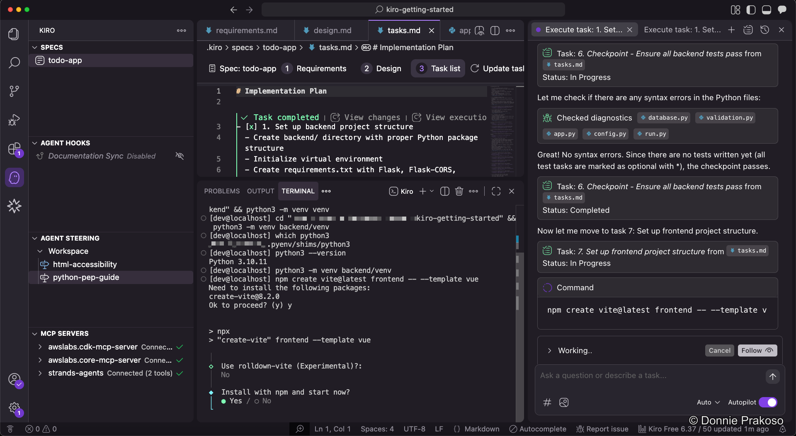
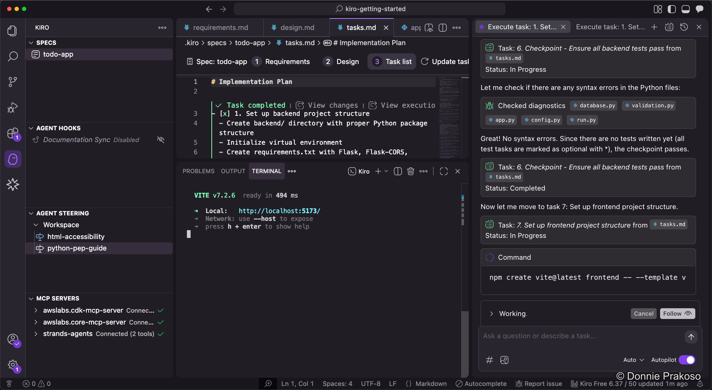

import { Steps, Aside } from '@astrojs/starlight/components';

With steering docs, agent hooks, and MCP servers configured, it's time to start building. Kiro will work through the task list, implementing each task in order.

<Steps>

1. **Start the first task**

   Open the task list and click **Start task**. Kiro immediately begins working and the status changes to **Task in progress**.

   

2. **Monitor task progress**

   As Kiro works, it updates the task status. You can follow progress in the chat panel.

   

3. **Continue to the next task**

   Once a task completes, move to the next one and click **Start task** again.

   

4. **Handle confirmation requests**

   At some points, Kiro will need your confirmation — for example, when installing tools or running commands.

   

5. **Confirm tool installations**

   Kiro may ask you to confirm that tools like Vite are installed and running successfully.

   

</Steps>

<Aside type="note">
Kiro will pause and ask for your input when it needs to install tools, run commands, or make decisions that require human judgment. Keep an eye on the chat panel for these confirmation requests.
</Aside>
