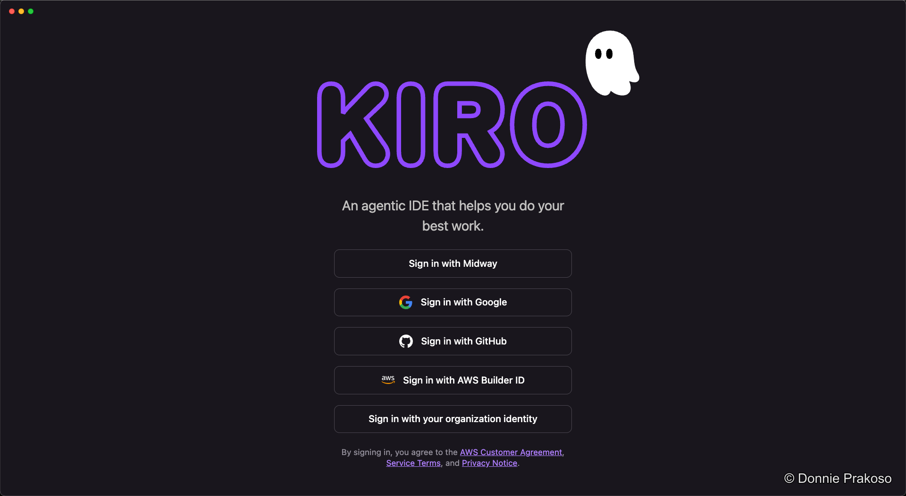
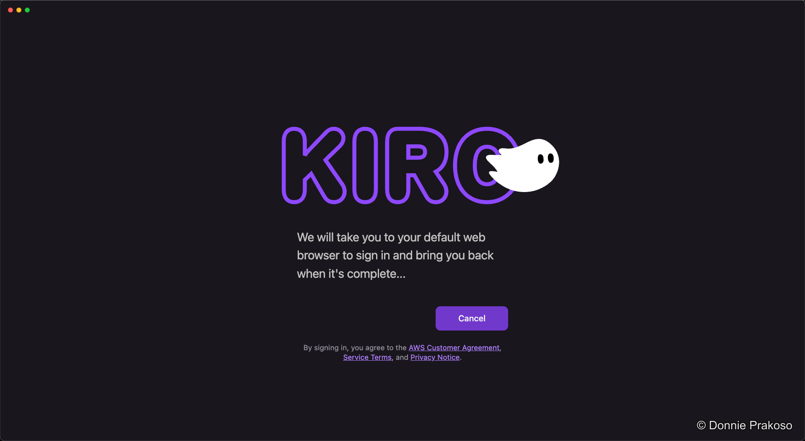
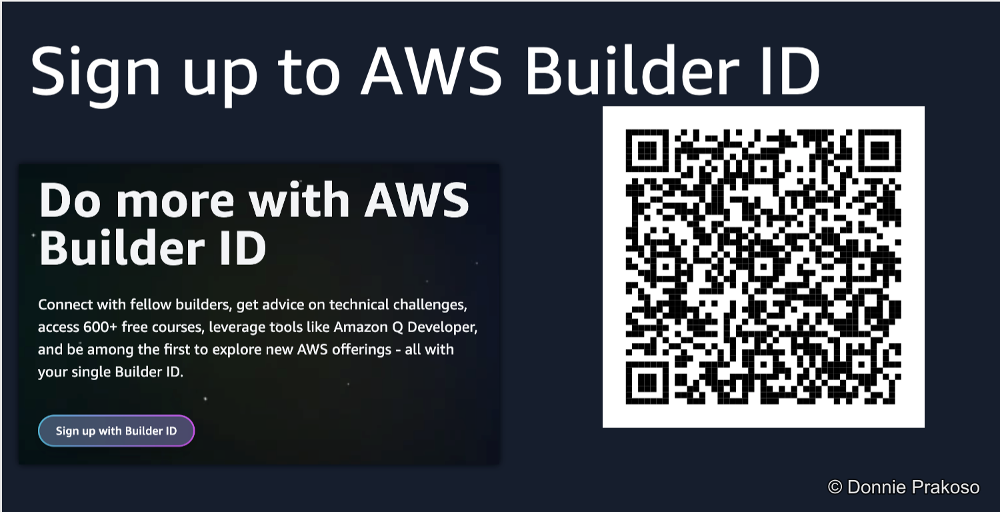
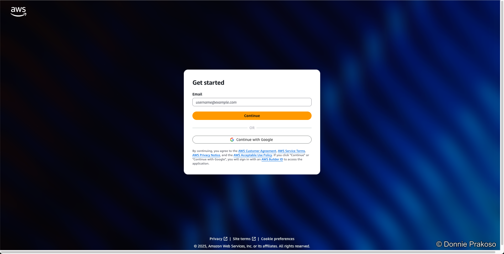

import { Steps, Aside } from '@astrojs/starlight/components';

<Aside type="tip">
You'll need an **AWS Builder ID** to use Kiro. It's free to create — [sign up here](https://builder.aws.com/start?trk=c4ea046f-18ad-4d23-a1ac-cdd1267f942c&sc_channel=el) if you don't have one.
</Aside>

<Steps>

1. **Open Kiro and sign in with AWS Builder ID**

   When you first launch Kiro, you'll see the sign-in screen. Select **AWS Builder ID** as your sign-in option.

   

2. **Complete browser-based authentication**

   Kiro will open your default browser to complete the sign-in process.

   

3. **Create an AWS Builder ID (if needed)**

   If you don't already have an AWS Builder ID, follow the sign-up flow in your browser.

   

4. **Sign in with your credentials**

   Enter your AWS Builder ID credentials to complete the authentication.

   

</Steps>

Once signed in, you'll be taken to the Kiro workspace where you can start building.
