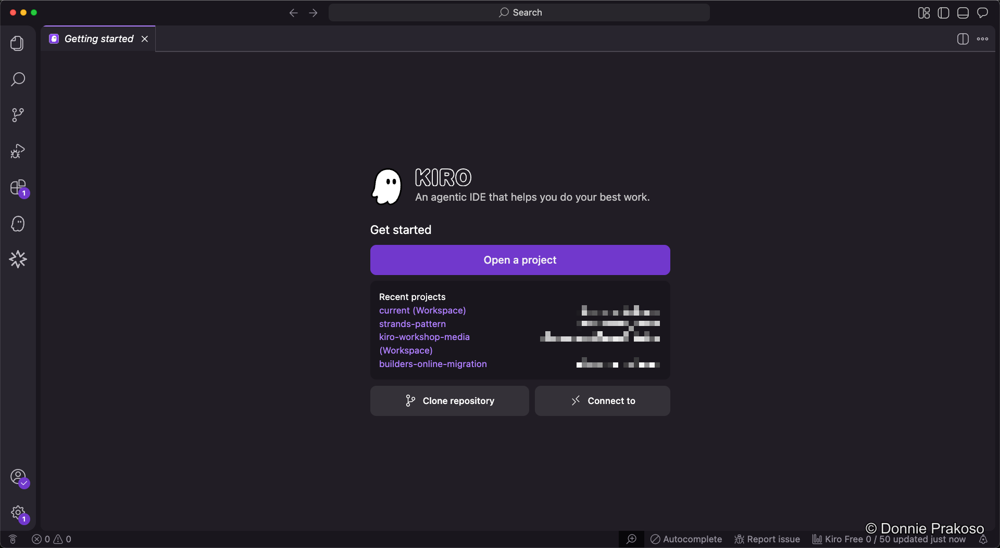
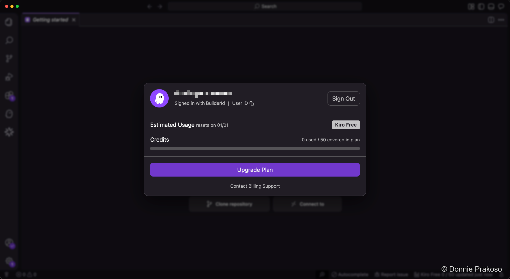

import { Steps, Aside } from '@astrojs/starlight/components';

## Getting started options

Kiro offers several ways to start working:

- **Open a project** — Add existing folders from your local machine into your workspace.
- **Clone a repository** — Clone a Git repository directly into your workspace.
- **Connect via SSH** — Connect to remote SSH servers (requires the SSH plugin).

You can also open the **Accounts** panel at the bottom left to view your usage details and account information.

## Understanding usage and credits

<Steps>

1. **Open the Accounts panel**

   Click the Accounts button to see your usage and credit information.

   

2. **Track your credit usage**

   Your Kiro usage resets on the first day of each month. The panel shows how many credits you've consumed.

</Steps>

<Aside type="tip">
To learn more about how Kiro uses credits, visit the [Kiro pricing documentation](https://kiro.dev/pricing/#what-is-a-credit).
</Aside>
