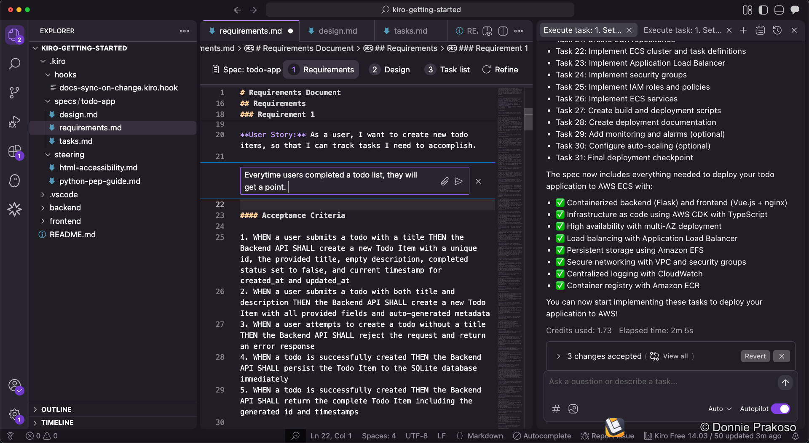
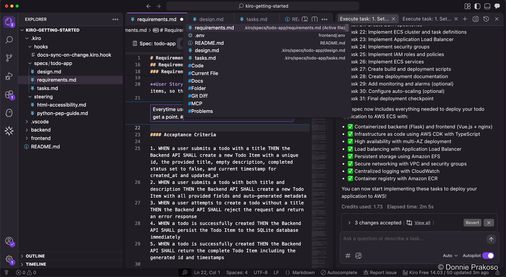

import { Aside } from '@astrojs/starlight/components';

## Using inline chat

Kiro's **Inline Chat** feature allows you to interact with Kiro directly in the editor, without opening a separate chat panel. This is useful for quick code modifications or asking questions about the current code context.

To activate Inline Chat, press **⌘ + I** (Mac) or **Ctrl + I** (Windows/Linux) while in the editor. You can select code and request modifications, ask questions, or trigger spec changes directly.

## Context with the # symbol

Within any Kiro chat input, the **#** symbol acts as a context provider. When you type `#`, an autocomplete menu appears, allowing you to quickly reference:

- Specific **files**
- **Folders**
- Predefined **steering files**

<Aside type="tip">
Inline Chat is great for small, focused changes. For larger features or structural changes, use the full Spec workflow to maintain structured documentation.
</Aside>

---

Congratulations! You've completed the Kiro IDE Workshop. You now know how to:

- Set up and configure Kiro IDE
- Use both Spec and Vibe coding modes
- Generate structured specs (requirements, design, tasks)
- Configure steering docs, agent hooks, and MCP servers
- Execute tasks and handle confirmations
- Test, iterate, and use checkpointing
- Use inline chat for quick edits

Happy building!
