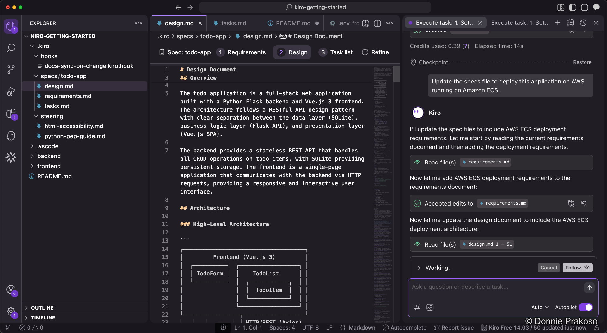
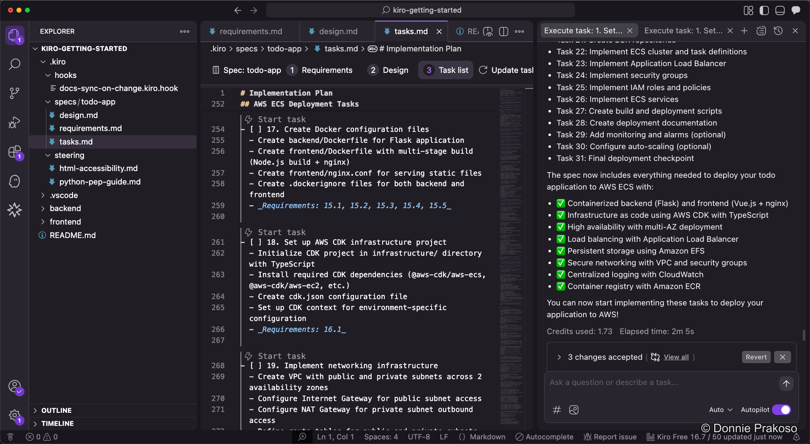

import { Steps, Aside } from '@astrojs/starlight/components';

One of the strengths of spec-driven development is the ability to iterate by updating your specs.

<Steps>

1. **Ask Kiro to update the specs**

   To add features or make changes, ask Kiro to update the specs file rather than making ad-hoc code changes.

   

2. **Review updated specs and task list**

   Kiro updates all the spec documents — requirements, design, and task list — to reflect the new changes. New tasks appear in the task list, ready to be executed.

   

   Then, you can start building with Kiro using the updated task list, just like before.

</Steps>

<Aside type="tip">
Iterating through specs keeps your documentation in sync with the code. Each iteration cycle follows the same structured process: update specs → review → execute tasks.
</Aside>
