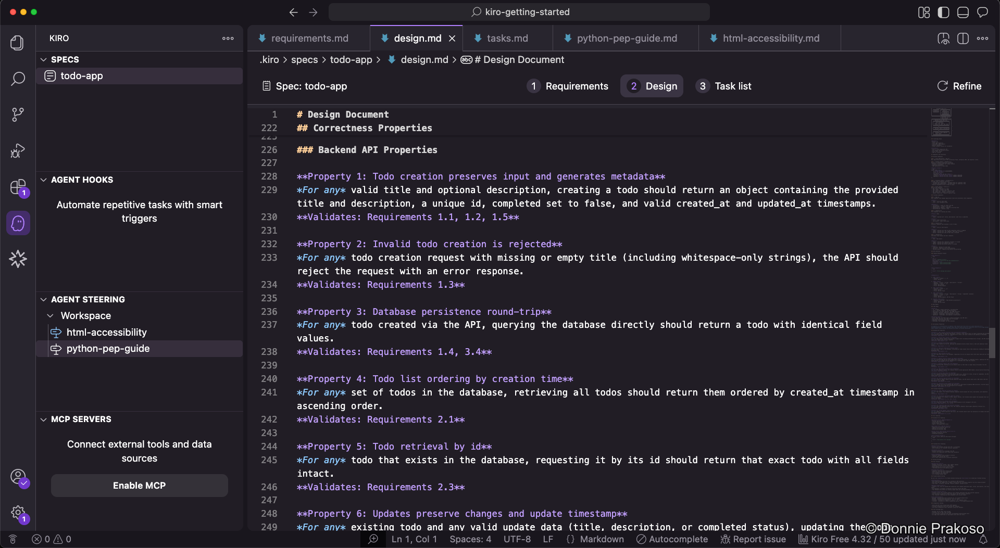
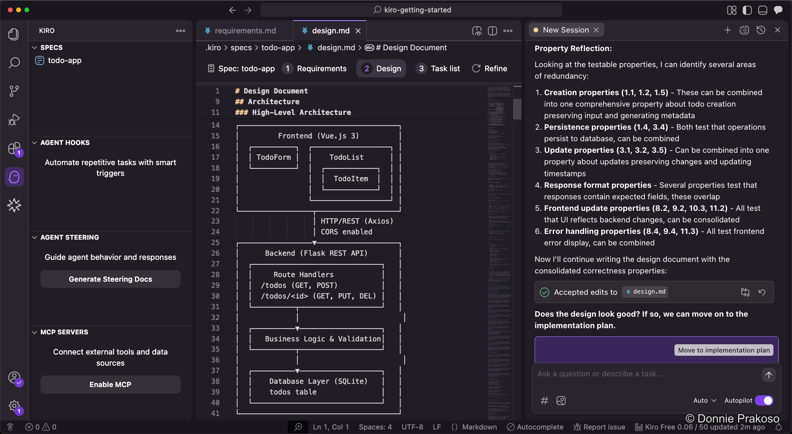
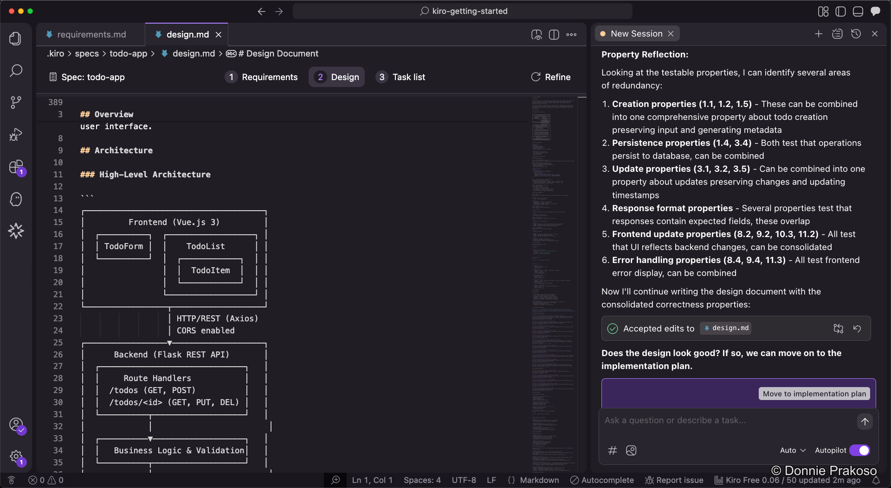
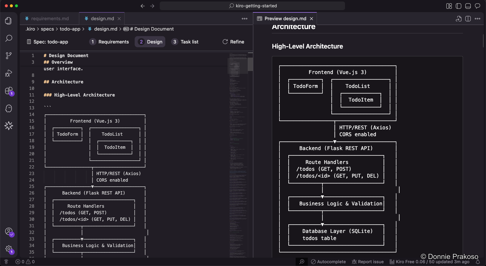

import { Steps, Aside } from '@astrojs/starlight/components';

The design phase is where Kiro produces detailed technical architecture for your application.

## Property-Based Testing

Kiro includes **Property-Based Testing (PBT)** — a feature that automatically translates natural language requirements into executable tests. These tests validate general system behaviours ("properties") across a wide range of automatically generated inputs, finding bugs that traditional example-based unit tests might miss.

<Aside type="tip">
Learn more about Property-Based Testing in Kiro's blog post: [Does your code match your spec?](https://kiro.dev/blog/property-based-testing/)
</Aside>

## Architecture diagram

<Steps>

1. **Review the architecture diagram**

   Kiro generates an architecture diagram as part of the design document, giving you a visual overview of how the system components interact.

   

2. **Preview the design document**

   Since spec documents are Markdown-based, you can preview them in a rendered view for easier reading.

   

3. **Review the rendered preview**

   The preview shows the full design document with formatted diagrams, tables, and structured content.

   

   You can preview all spec documents this way — requirements, design, and task list.

</Steps>
