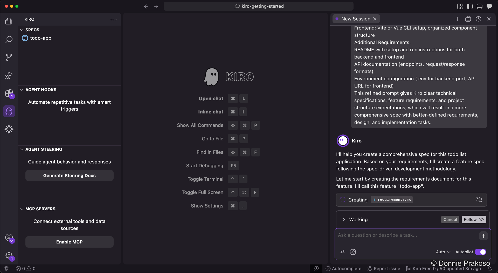
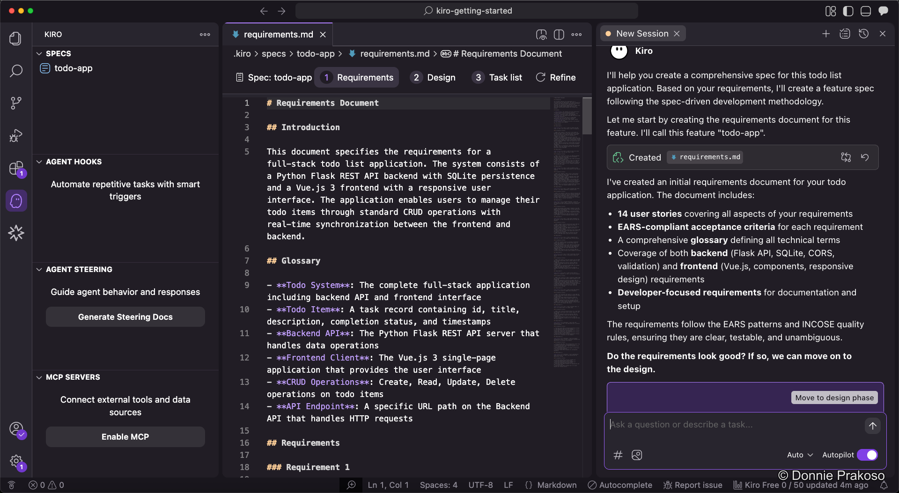
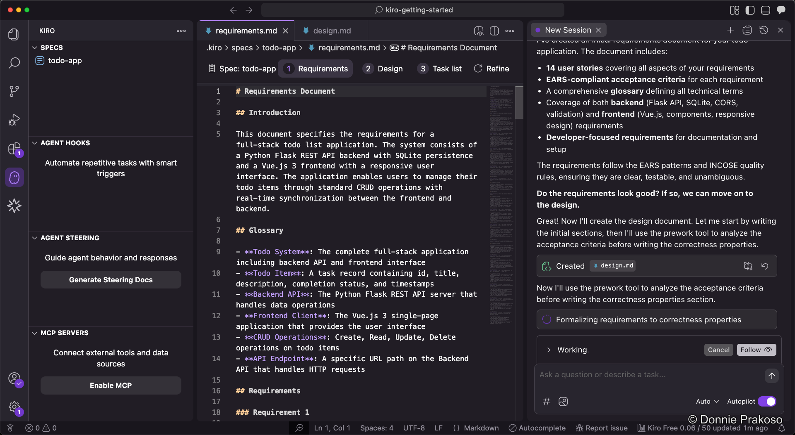

import { Steps, Aside } from '@astrojs/starlight/components';

Once you've submitted your prompt in Spec mode, Kiro begins generating structured specification documents.

<Steps>

1. **Kiro starts generating specs**

   After submitting the prompt, Kiro begins creating specs — structured artifacts that formalise the development process for your application.

   

2. **Review the requirements document**

   Specs are structured into three parts:

   - **Requirements** — User stories and acceptance criteria in structured EARS notation
   - **Design** — Technical architecture, sequence diagrams, and implementation considerations
   - **Task List** — A detailed implementation plan with discrete, trackable tasks

   

   Kiro generates the requirements document first. Review it and modify as needed — you have full control over what's included.

3. **Move to the design phase**

   Once you're satisfied with the requirements, click the button to proceed to the design phase. Kiro always follows the order: Requirements → Design → Task List.

   

   Kiro works on acceptance criteria and generates the design document based on your approved requirements.

</Steps>

<Aside type="note">
Kiro always generates specs in order: **Requirements** first, then **Design**, and finally the **Task List**. You can review and modify each document before proceeding to the next step.
</Aside>
