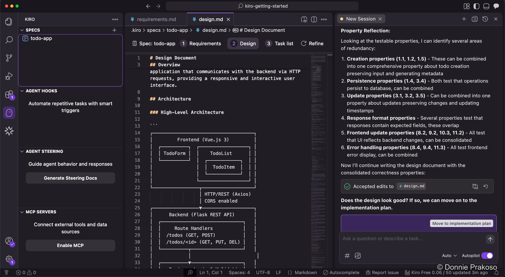
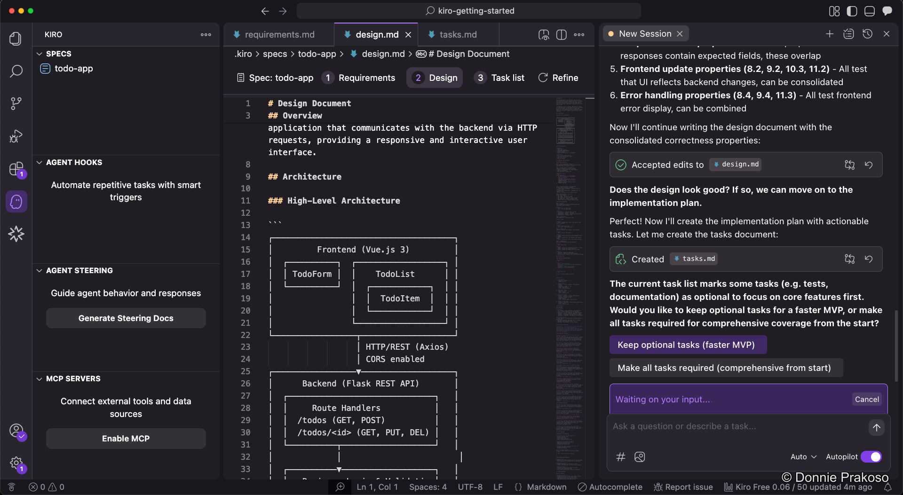

import { Steps, Aside } from '@astrojs/starlight/components';

After reviewing the design document, you move to the final spec phase — the implementation plan.

<Steps>

1. **Generate the implementation plan**

   Click the button to proceed from design to implementation planning. Kiro will create a structured task list based on the approved requirements and design.

   

2. **Choose MVP or comprehensive tests**

   Kiro will ask whether you want to create a faster **MVP** application or implement **comprehensive tests**.

   

</Steps>

<Aside type="note">
**MVP vs Comprehensive**: If you keep optional tasks, Kiro moves fast and creates the app quickly — though there may be potential issues. If you instruct Kiro to do all tasks including optional tests, it takes longer but produces a more stable result. The choice depends on your situation.
</Aside>

With the implementation plan generated, you now have a complete set of specs:
- **Requirements** — What the app should do
- **Design** — How it should be built
- **Task List** — Step-by-step implementation plan

Before executing the tasks, let's configure Kiro's workspace with steering docs, agent hooks, and MCP servers.
