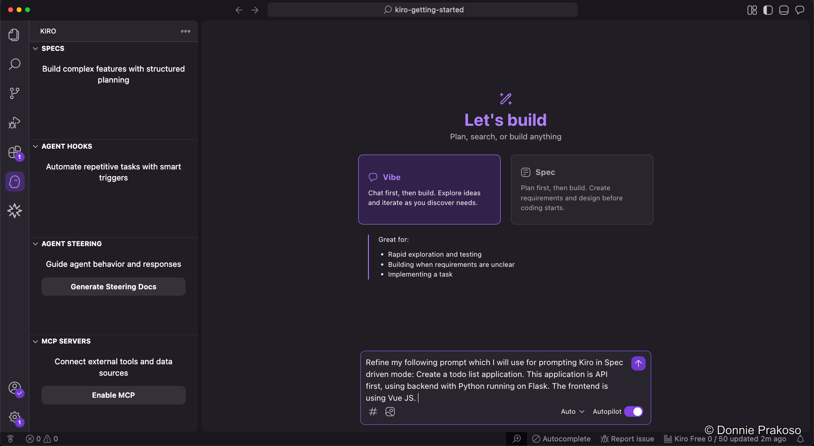
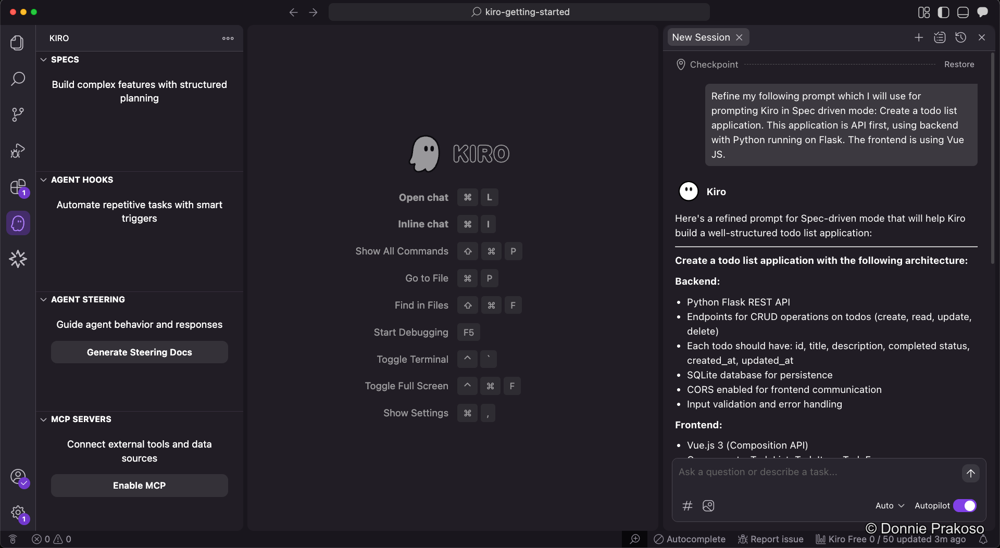
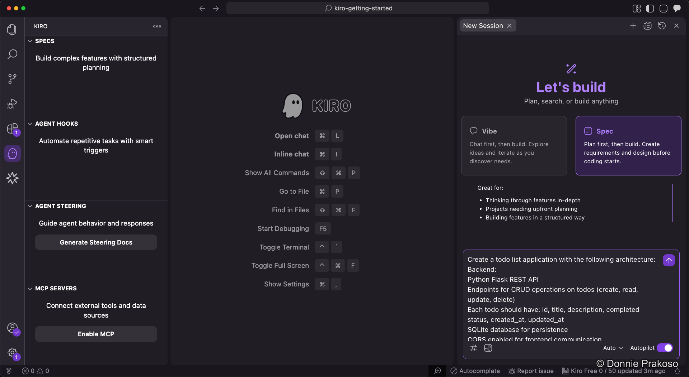

import { Steps, Aside } from '@astrojs/starlight/components';

A powerful workflow in Kiro is using **Vibe mode to refine your prompt** before passing it to **Spec mode**. This gives you a more detailed, well-structured prompt without having to write it all yourself.

<Steps>

1. **Select Vibe mode and ask Kiro to refine your prompt**

   Switch to **Vibe** coding mode and enter a prompt asking Kiro to refine your original idea:

   ```text title="Vibe refinement prompt"
   Refine my following prompt which I will use for prompting Kiro in Spec driven mode: Create a todo list application. This application is API first, using backend with Python running on Flask. The frontend is using Vue JS.
   ```

   

2. **Review the refined prompt**

   Kiro generates a much more detailed, structured prompt. The refined output includes specific architecture decisions, technology choices, and feature requirements:

   

   The refined prompt specifies details like:
   - **Backend**: Python Flask REST API with CRUD operations, SQLite for persistence, CORS enabled
   - **Frontend**: Vue.js 3 with Composition API
   - **Data model**: Each todo with id, title, description, completed status, timestamps

3. **Switch to Spec mode and paste the refined prompt**

   Now select **Spec** mode and pass the refined prompt into the Spec input.

   

</Steps>

<Aside type="tip">
This Vibe-then-Spec workflow is a best practice: use Vibe for creative exploration and prompt refinement, then switch to Spec for structured, trackable development.
</Aside>
