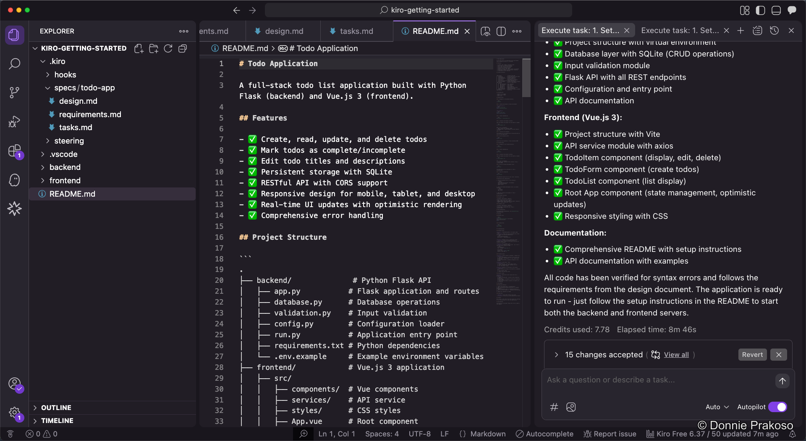
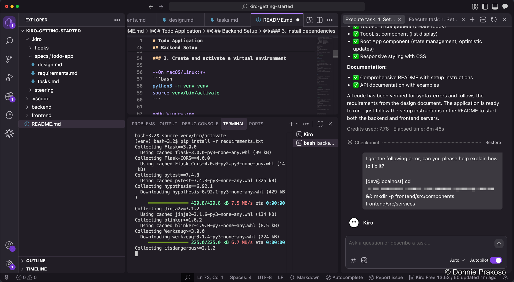

import { Steps, Aside } from '@astrojs/starlight/components';

## Reviewing the README

Kiro adds all the information you need to `README.md`, including setup instructions, dependencies, and how to run the application.



<Aside type="tip">
It's good practice to set up an **Agent Hook** or manually ask Kiro to update `README.md` whenever there's an update to the project. This keeps documentation in sync with the code.
</Aside>

## Installing requirements

<Steps>

1. **Follow the README instructions**

   While you can ask Kiro to run the setup for you, it's still good practice to follow the instructions in `README.md` manually. This helps you understand the project structure and dependencies.

   

2. **Install backend dependencies**

   ```bash title="Install Python requirements"
   pip install -r requirements.txt
   ```

3. **Install frontend dependencies**

   ```bash title="Install frontend packages"
   npm install
   ```

</Steps>
