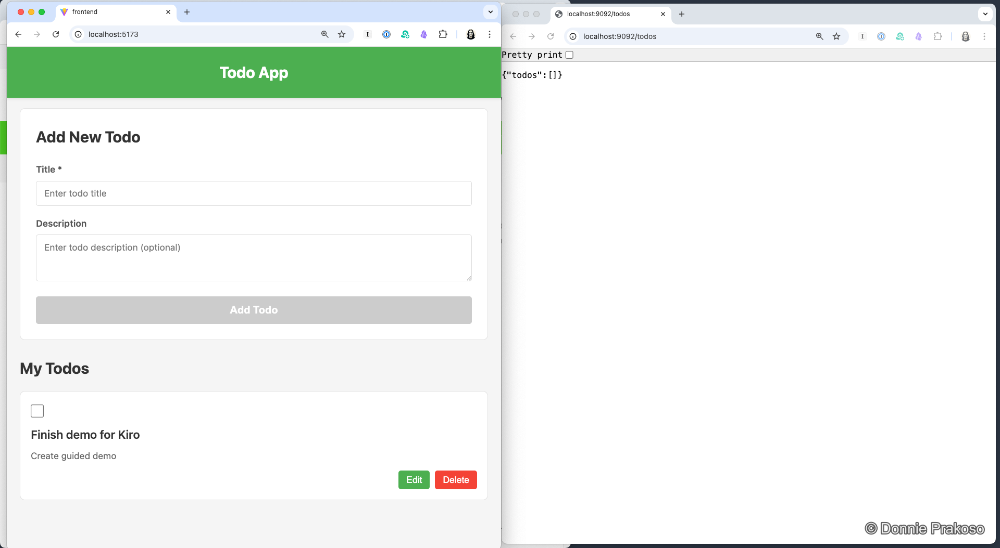
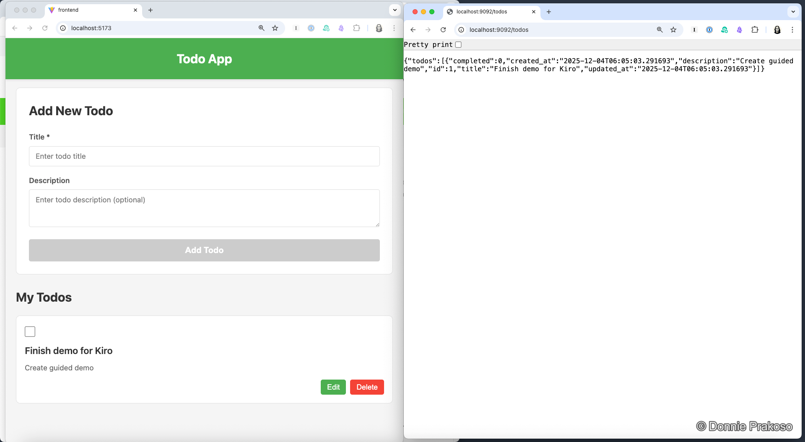

import { Steps, Aside } from '@astrojs/starlight/components';

## Running the application

<Steps>

1. **Start both frontend and backend**

   Run the Flask backend and Vue.js frontend in separate terminals.

   

   The frontend application connects to the backend APIs to manage todos.

2. **Test the todo list**

   Add a new todo item to verify the application works end-to-end.

   

   The frontend interacts with the backend APIs — the full stack is working!

</Steps>

<Aside type="tip">
If you encounter issues, you can use Kiro's **Checkpointing** feature to restore to a previous working state (covered in the next section).
</Aside>
